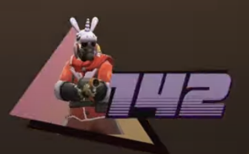

# TheCodeMechanic

### Todo list

- [ ] replicate this cool avatar using your face 
- [ ] vista print contact cards.

- [ ] copy the nice heros from nssintel
- [ ] clone the x-edit impl and connect to your pb
  at: https://pocketbase-railway-codemechanic.up.railway.app/_/#/collections?collectionId=k6i362ujbg0ka9y&filter=&sort=-created
- [ ] hide nssintel (add a views collection and toggles)
- [ ] add views collection and toggles to CM; deploy and test.
- [ ] add bragging gifs of that galaxy / make a new galaxy with little holographic language icons (c#, python, TS, k8s;
  whatever looks good). Cyberspace!
    - Something akin to this interactivity, but with custom shaped
      particles: https://tympanus.net/codrops/2019/01/17/interactive-particles-with-three-js/; This particular example
      will probably go over very well with recruiters and mil/defense.
- 

